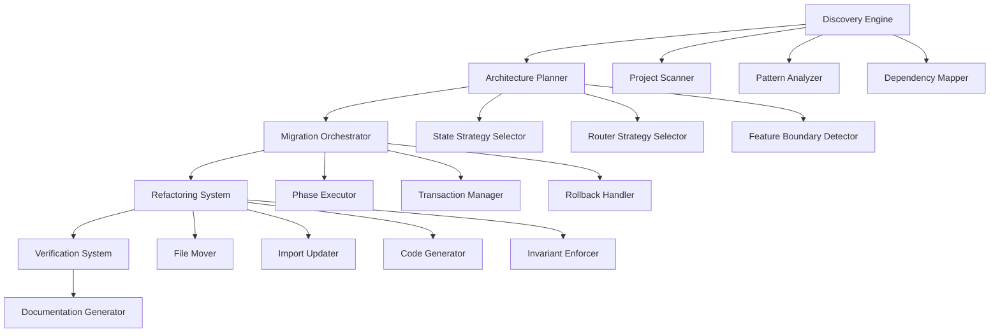

# Design Document: Enterprise Architecture Refactor

## Overview

This design specifies an automated refactoring system that transforms a React + TypeScript + Vite application from a flat component structure into an enterprise-grade, feature-driven architecture. The system consists of four major components: Discovery Engine, Architecture Planner, Migration Orchestrator, and Refactoring System. The prime directive is behavior preservation—all refactoring maintains identical application functionality while improving structure, maintainability, and scalability.

### Goals

- Transform flat component structure into feature-driven vertical slices
- Enforce architectural invariants through automated tooling
- Implement centralized API layer with TanStack Query + Axios
- Consolidate state management into a consistent pattern
- Enable lazy loading and code splitting at feature boundaries
- Achieve 100% TypeScript strict mode compliance
- Maintain zero functional changes during migration

### Non-Goals

- Adding new features or functionality
- Changing UI/UX design or styling
- Modifying business logic or algorithms
- Performance optimization beyond architectural improvements
- Backend API changes

## Architecture

### System Components



### High-Level Architecture

The system operates as a pipeline with distinct phases:

1. **Discovery Phase**: Scans existing codebase, identifies patterns, maps dependencies
2. **Planning Phase**: Makes strategic decisions about state management, routing, and feature boundaries
3. **Migration Phase**: Executes 6-phase migration strategy with atomic operations
4. **Verification Phase**: Runs tests, checks TypeScript compilation, validates invariants
5. **Documentation Phase**: Generates architecture docs, migration guides, and ADRs

### Target Folder Structure

```
src/
├── app/                          # Application shell
│   ├── providers/                # Global providers (Theme, Query, etc.)
│   │   ├── index.ts
│   │   ├── QueryProvider.tsx
│   │   └── ThemeProvider.tsx
│   ├── router/                   # Router configuration
│   │   ├── index.ts
│   │   ├── routes.tsx
│   │   └── guards.ts
│   ├── store/                    # Global store setup (if Redux/Zustand)
│   │   ├── index.ts
│   │   └── rootReducer.ts
│   └── index.ts
│
├── features/                     # Feature-driven vertical slices
│   ├── auth/
│   │   ├── components/           # Feature-specific components
│   │   │   ├── LoginForm.tsx
│   │   │   ├── SignupForm.tsx
│   │   │   └── index.ts
│   │   ├── hooks/                # Feature-specific hooks
│   │   │   ├── useAuth.ts
│   │   │   ├── useLogin.ts
│   │   │   └── index.ts
│   │   ├── services/             # Feature-specific API services
│   │   │   ├── authService.ts
│   │   │   └── index.ts
│   │   ├── state/                # Feature-specific state
│   │   │   ├── authSlice.ts      # Redux slice or Zustand store
│   │   │   └── index.ts
│   │   ├── types/                # Feature-specific types
│   │   │   ├── auth.types.ts
│   │   │   └── index.ts
│   │   ├── utils/                # Feature-specific utilities
│   │   │   ├── validation.ts
│   │   │   └── index.ts
│   │   ├── pages/                # Feature pages
│   │   │   ├── LoginPage.tsx
│   │   │   ├── SignupPage.tsx
│   │   │   └── index.ts
│   │   ├── tests/                # Feature tests
│   │   │   ├── auth.test.ts
│   │   │   └── authService.test.ts
│   │   └── index.ts              # Public API barrel export
│   │
│   ├── chat/
│   │   ├── components/
│   │   │   ├── Chat.tsx
│   │   │   ├── ChatHeader.tsx
│   │   │   ├── ChatHistory.tsx
│   │   │   ├── ChatItem.tsx
│   │   │   ├── Message.tsx
│   │   │   ├── MultimodalInput.tsx
│   │   │   └── index.ts
│   │   ├── hooks/
│   │   │   ├── useChat.ts
│   │   │   └── index.ts
│   │   ├── services/
│   │   │   ├── chatService.ts
│   │   │   └── index.ts
│   │   ├── state/
│   │   │   ├── chatSlice.ts
│   │   │   └── index.ts
│   │   ├── types/
│   │   │   ├── chat.types.ts
│   │   │   └── index.ts
│   │   ├── pages/
│   │   │   ├── ChatPage.tsx
│   │   │   └── index.ts
│   │   └── index.ts
│   │
│   └── theme/
│       ├── hooks/
│       │   ├── useTheme.ts
│       │   ├── useToken.ts
│       │   └── index.ts
│       ├── components/
│       │   ├── ThemeToggle.tsx
│       │   └── index.ts
│       ├── state/
│       │   ├── themeContext.ts
│       │   └── index.ts
│       ├── types/
│       │   ├── theme.types.ts
│       │   └── index.ts
│       └── index.ts
│
├── components/                   # Shared UI components
│   ├── ui/                       # Base UI primitives
│   │   ├── Button.tsx
│   │   ├── Input.tsx
│   │   ├── Label.tsx
│   │   ├── Textarea.tsx
│   │   ├── DropdownMenu.tsx
│   │   ├── Spinner.tsx
│   │   └── index.ts
│   ├── layout/                   # Layout components
│   │   ├── Sidebar.tsx
│   │   ├── SidebarFooter.tsx
│   │   └── index.ts
│   ├── common/                   # Common composite components
│   │   ├── PasswordStrengthMeter.tsx
│   │   └── index.ts
│   └── index.ts
│
├── hooks/                        # Global reusable hooks
│   ├── useLocalStorage.ts
│   ├── useDebounce.ts
│   ├── useMediaQuery.ts
│   └── index.ts
│
├── services/                     # Infrastructure & API layer
│   ├── api/
│   │   ├── client.ts             # Axios instance with interceptors
│   │   ├── queryClient.ts        # TanStack Query client config
│   │   └── index.ts
│   └── index.ts
│
├── store/                        # Global state management
│   ├── index.ts                  # Store configuration
│   └── middleware.ts             # Custom middleware
│
├── lib/                          # Third-party integrations
│   ├── utils.ts                  # Class name utilities
│   └── index.ts
│
├── utils/                        # Pure utility functions
│   ├── uuid.ts
│   ├── formatters.ts
│   ├── validators.ts
│   └── index.ts
│
├── types/                        # Global TypeScript types
│   ├── api.types.ts
│   ├── common.types.ts
│   └── index.ts
│
├── constants/                    # Application-wide constants
│   ├── routes.ts
│   ├── api.ts
│   └── index.ts
│
├── config/                       # Environment configuration
│   ├── env.ts                    # Type-safe env vars with Zod
│   ├── index.ts
│   └── .env.example
│
├── assets/                       # Static assets
│   ├── images/
│   ├── icons/
│   └── index.ts
│
├── styles/                       # Global styles
│   ├── global.css
│   ├── tokens.ts                 # Design tokens
│   ├── generateCssVars.ts
│   └── index.ts
│
├── main.tsx                      # Application entry point
└── vite-env.d.ts                 # Vite type declarations
```

## Components and Interfaces

### 1. Discovery Engine

The Discovery Engine scans the existing codebase and builds a comprehensive model of the current architecture.

#### 1.1 Project Scanner

**Responsibility**: Traverse the file system and catalog all project files.

```typescript
interface FileNode {
  path: string;
  name: string;
  type: 'file' | 'directory';
  extension?: string;
  size: number;
  children?: FileNode[];
}

interface ProjectScanner {
  scan(rootPath: string): Promise<FileNode>;
  filterByExtension(extensions: string[]): FileNode[];
  getEntryPoints(): string[];
}
```

**Algorithm**:
1. Start from project root
2. Recursively traverse directories
3. Skip node_modules, dist, .git
4. Build tree structure with metadata
5. Identify entry points (main.tsx, App.tsx)

#### 1.2 Pattern Analyzer

**Responsibility**: Identify architectural patterns in the codebase.

```typescript
interface Pattern {
  type: 'component' | 'hook' | 'context' | 'service' | 'util' | 'page';
  path: string;
  name: string;
  exports: string[];
  imports: ImportStatement[];
}

interface ImportStatement {
  source: string;
  specifiers: string[];
  isRelative: boolean;
  isExternal: boolean;
}

interface PatternAnalyzer {
  analyzeFile(filePath: string): Promise<Pattern>;
  identifyComponents(): Pattern[];
  identifyHooks(): Pattern[];
  identifyContexts(): Pattern[];
  identifyPages(): Pattern[];
  identifyApiCalls(): ApiCallPattern[];
}

interface ApiCallPattern {
  file: string;
  line: number;
  method: 'fetch' | 'axios';
  url: string;
  httpMethod: 'GET' | 'POST' | 'PUT' | 'DELETE' | 'PATCH';
}
```

**Algorithm**:
1. Parse TypeScript AST using ts-morph or @babel/parser
2. Extract imports, exports, function declarations
3. Identify React components (function returning JSX)
4. Identify hooks (functions starting with 'use')
5. Identify Context providers (createContext usage)
6. Identify API calls (fetch/axios usage)
7. Classify files by pattern type

#### 1.3 Dependency Mapper

**Responsibility**: Build dependency graph of the codebase.

```typescript
interface DependencyNode {
  file: string;
  dependencies: string[];
  dependents: string[];
  isExternal: boolean;
}

interface DependencyGraph {
  nodes: Map<string, DependencyNode>;
  edges: Array<[string, string]>;
}

interface DependencyMapper {
  buildGraph(): Promise<DependencyGraph>;
  findCircularDependencies(): string[][];
  findOrphanedFiles(): string[];
  calculateCoupling(file: string): number;
  findStronglyConnectedComponents(): string[][];
}
```

**Algorithm**:
1. For each file, extract all import statements
2. Resolve import paths to absolute file paths
3. Build directed graph: file -> dependencies
4. Detect cycles using Tarjan's algorithm
5. Calculate coupling metrics (fan-in, fan-out)
6. Identify strongly connected components for feature boundaries

### 2. Architecture Planner

The Architecture Planner makes strategic decisions about the target architecture.

#### 2.1 State Strategy Selector

**Responsibility**: Choose appropriate state management strategy.

```typescript
interface StateComplexity {
  globalStateCount: number;
  contextCount: number;
  crossFeatureStateSharing: number;
  asyncStateOperations: number;
}

interface StateStrategy {
  type: 'redux-toolkit' | 'zustand' | 'context-query';
  rationale: string;
  migrationSteps: string[];
}

interface StateStrategySelector {
  analyzeComplexity(): StateComplexity;
  selectStrategy(complexity: StateComplexity): StateStrategy;
}
```

**Decision Algorithm**:
```typescript
function selectStateStrategy(complexity: StateComplexity): StateStrategy {
  // Simple: few global states, mostly local state
  if (complexity.globalStateCount <= 3 && 
      complexity.crossFeatureStateSharing === 0) {
    return {
      type: 'context-query',
      rationale: 'Simple state management with isolated features. Context for UI state, TanStack Query for server state.',
      migrationSteps: [...]
    };
  }
  
  // Complex: many global states, cross-feature sharing
  if (complexity.globalStateCount > 10 || 
      complexity.crossFeatureStateSharing > 5) {
    return {
      type: 'redux-toolkit',
      rationale: 'Complex state with cross-feature interactions. Redux Toolkit provides predictable state management with DevTools.',
      migrationSteps: [...]
    };
  }
  
  // Moderate: isolated feature states
  return {
    type: 'zustand',
    rationale: 'Moderate complexity with feature-isolated state. Zustand provides simple API with good TypeScript support.',
    migrationSteps: [...]
  };
}
```

#### 2.2 Router Strategy Selector

**Responsibility**: Choose routing library and configuration.

```typescript
interface RouterComplexity {
  routeCount: number;
  nestedRoutes: number;
  requiresTypesSafety: boolean;
  requiresCodeSplitting: boolean;
}

interface RouterStrategy {
  type: 'tanstack-router' | 'react-router-v6';
  rationale: string;
  configuration: RouterConfig;
}

interface RouterStrategySelector {
  analyzeRouting(): RouterComplexity;
  selectStrategy(complexity: RouterComplexity): RouterStrategy;
}
```

**Decision Algorithm**:
```typescript
function selectRouterStrategy(complexity: RouterComplexity): RouterStrategy {
  // Type-safe routing with automatic code splitting
  if (complexity.requiresTypesSafety && complexity.routeCount > 10) {
    return {
      type: 'tanstack-router',
      rationale: 'Type-safe routing with automatic code splitting and route-based data loading.',
      configuration: {...}
    };
  }
  
  // Standard routing
  return {
    type: 'react-router-v6',
    rationale: 'Standard routing with manual lazy loading. Simpler setup for moderate complexity.',
    configuration: {...}
  };
}
```

#### 2.3 Feature Boundary Detector

**Responsibility**: Identify feature boundaries from dependency graph.

```typescript
interface FeatureBoundary {
  name: string;
  files: string[];
  entryPoints: string[];
  sharedDependencies: string[];
  coupling: number;
}

interface FeatureBoundaryDetector {
  detectBoundaries(graph: DependencyGraph): FeatureBoundary[];
  clusterByDependencies(): Map<string, string[]>;
  clusterByRouting(): Map<string, string[]>;
  clusterByState(): Map<string, string[]>;
  mergeClusters(): FeatureBoundary[];
}
```

**Algorithm**:
1. **Dependency Clustering**: Use Louvain algorithm to find communities in dependency graph
2. **Routing Clustering**: Group files by route structure (e.g., /login, /signup -> auth feature)
3. **State Clustering**: Group files sharing same Context or state
4. **Merge Clusters**: Combine overlapping clusters with high cohesion
5. **Validate Boundaries**: Ensure each feature has clear entry/exit points

### 3. Migration Orchestrator

The Migration Orchestrator executes the 6-phase migration strategy.

#### 3.1 Phase Executor

**Responsibility**: Execute each migration phase with verification.

```typescript
interface MigrationPhase {
  id: number;
  name: string;
  description: string;
  tasks: MigrationTask[];
  verification: VerificationStep[];
}

interface MigrationTask {
  id: string;
  description: string;
  execute(): Promise<void>;
  rollback(): Promise<void>;
}

interface PhaseExecutor {
  executePhase(phase: MigrationPhase): Promise<PhaseResult>;
  verifyPhase(phase: MigrationPhase): Promise<VerificationResult>;
  handleFailure(phase: MigrationPhase, error: Error): Promise<void>;
}

interface PhaseResult {
  success: boolean;
  tasksCompleted: number;
  tasksTotal: number;
  errors: Error[];
  duration: number;
}
```

**Phases**:

**Phase 1: Foundation Setup**
- Create target folder structure
- Generate configuration files (vite.config.ts, tsconfig.json, .eslintrc.cjs)
- Set up path aliases
- Install required dependencies (TanStack Query, Axios, etc.)

**Phase 2: Shared Infrastructure Migration**
- Move shared UI components to components/
- Move global hooks to hooks/
- Move utilities to utils/
- Create barrel exports (index.ts)
- Update all imports to use path aliases

**Phase 3: Feature Extraction**
- Extract auth feature (LoginPage, SignupPage, useToken)
- Extract chat feature (Chat components, ChatContext)
- Extract theme feature (ThemeContext, ThemeToggle)
- Create feature folder structure
- Move files to feature directories
- Update imports

**Phase 4: API Layer Implementation**
- Create API client with Axios
- Implement request/response interceptors
- Create TanStack Query hooks for endpoints
- Migrate all fetch/axios calls to use API client
- Add error handling and retry logic

**Phase 5: State Management Migration**
- Implement chosen state strategy
- Migrate ChatContext to new pattern
- Migrate ThemeContext to new pattern
- Separate server state from client state
- Add TypeScript types for all state

**Phase 6: Performance Hardening**
- Implement lazy loading for routes
- Add code splitting at feature boundaries
- Add React.memo for expensive components
- Configure Vite for optimal chunking
- Verify bundle size reduction

#### 3.2 Transaction Manager

**Responsibility**: Ensure atomic operations with rollback capability.

```typescript
interface Transaction {
  id: string;
  operations: FileOperation[];
  timestamp: Date;
  status: 'pending' | 'committed' | 'rolled-back';
}

interface FileOperation {
  type: 'move' | 'create' | 'update' | 'delete';
  sourcePath?: string;
  targetPath: string;
  content?: string;
  backup?: string;
}

interface TransactionManager {
  beginTransaction(): Transaction;
  addOperation(transaction: Transaction, operation: FileOperation): void;
  commit(transaction: Transaction): Promise<void>;
  rollback(transaction: Transaction): Promise<void>;
  createBackup(filePath: string): Promise<string>;
  restoreBackup(backupPath: string, targetPath: string): Promise<void>;
}
```

**Algorithm**:
1. **Begin Transaction**: Create transaction record, generate unique ID
2. **Add Operations**: Queue file operations with backup paths
3. **Create Backups**: Copy original files to .backup/ directory
4. **Execute Operations**: Perform file moves/updates atomically
5. **Verify**: Check all imports resolve, TypeScript compiles
6. **Commit**: Delete backups, mark transaction complete
7. **Rollback** (on failure): Restore all files from backups

### 4. Refactoring System

The Refactoring System performs low-level code transformations.

#### 4.1 File Mover

**Responsibility**: Move files and update references.

```typescript
interface FileMover {
  moveFile(source: string, target: string): Promise<void>;
  moveDirectory(source: string, target: string): Promise<void>;
  updateImports(movedFile: string, oldPath: string, newPath: string): Promise<void>;
}
```

**Algorithm**:
1. Validate source file exists
2. Create target directory if needed
3. Copy file to target location
4. Find all files importing the moved file
5. Update import paths in all dependent files
6. Verify all imports resolve
7. Delete source file

#### 4.2 Import Updater

**Responsibility**: Update import statements to use path aliases.

```typescript
interface ImportUpdater {
  updateToPathAlias(filePath: string): Promise<void>;
  resolvePathAlias(importPath: string, fromFile: string): string;
  sortImports(filePath: string): Promise<void>;
}
```

**Algorithm**:
1. Parse file AST
2. Extract all import statements
3. For each import:
   - Resolve to absolute path
   - Determine appropriate path alias
   - Replace relative path with alias
4. Sort imports: external, internal, relative, styles
5. Write updated file

**Import Sorting Order**:
```typescript
// 1. External dependencies
import React from 'react';
import { useQuery } from '@tanstack/react-query';

// 2. Internal path aliases
import { Button } from '@components/ui';
import { useAuth } from '@features/auth';

// 3. Relative imports (within same feature)
import { LoginForm } from './components/LoginForm';

// 4. Styles
import './styles.css';
```

#### 4.3 Code Generator

**Responsibility**: Generate reference implementations and boilerplate.

```typescript
interface CodeGenerator {
  generateApiClient(): string;
  generateFeatureStructure(featureName: string): void;
  generateBarrelExport(directory: string): string;
  generateRouterConfig(routes: RouteDefinition[]): string;
  generateEnvConfig(variables: EnvVariable[]): string;
}
```

**Templates**:

**API Client Template**:
```typescript
// services/api/client.ts
import axios, { AxiosInstance, AxiosError } from 'axios';
import { env } from '@config/env';

const apiClient: AxiosInstance = axios.create({
  baseURL: env.API_BASE_URL,
  timeout: 10000,
  headers: {
    'Content-Type': 'application/json',
  },
});

// Request interceptor: inject auth token
apiClient.interceptors.request.use(
  (config) => {
    const token = localStorage.getItem('auth_token');
    if (token) {
      config.headers.Authorization = `Bearer ${token}`;
    }
    return config;
  },
  (error) => Promise.reject(error)
);

// Response interceptor: handle errors
apiClient.interceptors.response.use(
  (response) => response,
  (error: AxiosError) => {
    if (error.response?.status === 401) {
      // Handle unauthorized
      localStorage.removeItem('auth_token');
      window.location.href = '/login';
    }
    return Promise.reject(error);
  }
);

export { apiClient };
```

**TanStack Query Hook Template**:
```typescript
// features/auth/hooks/useLogin.ts
import { useMutation } from '@tanstack/react-query';
import { authService } from '../services/authService';
import type { LoginCredentials, AuthResponse } from '../types/auth.types';

export function useLogin() {
  return useMutation({
    mutationFn: (credentials: LoginCredentials) => 
      authService.login(credentials),
    onSuccess: (data: AuthResponse) => {
      localStorage.setItem('auth_token', data.token);
    },
    onError: (error) => {
      console.error('Login failed:', error);
    },
  });
}
```

**Feature Service Template**:
```typescript
// features/auth/services/authService.ts
import { apiClient } from '@services/api/client';
import type { LoginCredentials, SignupData, AuthResponse } from '../types/auth.types';

export const authService = {
  login: async (credentials: LoginCredentials): Promise<AuthResponse> => {
    const { data } = await apiClient.post<AuthResponse>('/auth/login', credentials);
    return data;
  },

  signup: async (signupData: SignupData): Promise<AuthResponse> => {
    const { data } = await apiClient.post<AuthResponse>('/auth/signup', signupData);
    return data;
  },

  logout: async (): Promise<void> => {
    await apiClient.post('/auth/logout');
    localStorage.removeItem('auth_token');
  },

  getCurrentUser: async (): Promise<User> => {
    const { data } = await apiClient.get<User>('/auth/me');
    return data;
  },
};
```

#### 4.4 Invariant Enforcer

**Responsibility**: Enforce architectural rules through ESLint and custom checks.

```typescript
interface InvariantRule {
  id: string;
  description: string;
  check(file: string): Promise<Violation[]>;
}

interface Violation {
  rule: string;
  file: string;
  line: number;
  message: string;
  suggestedFix?: string;
}

interface InvariantEnforcer {
  checkFile(filePath: string): Promise<Violation[]>;
  checkProject(): Promise<Violation[]>;
  autoFix(violation: Violation): Promise<void>;
}
```

**Invariant Rules**:

1. **No Direct API Calls in Components**
   - Check: Search for fetch/axios in component files
   - Fix: Extract to service layer, create TanStack Query hook

2. **No Cross-Feature Imports**
   - Check: Verify imports don't cross feature boundaries
   - Fix: Move shared code to components/ or create shared service

3. **No Any Types**
   - Check: Search for `: any` or `as any`
   - Fix: Infer proper type or create type definition

4. **All Routes Lazy Loaded**
   - Check: Verify route components use React.lazy
   - Fix: Wrap component in lazy() call

5. **Barrel Exports Required**
   - Check: Verify each directory has index.ts
   - Fix: Generate barrel export

## Data Models

### Discovery Models

```typescript
// Discovery output
interface DiscoveryReport {
  projectInfo: ProjectInfo;
  fileTree: FileNode;
  patterns: {
    components: Pattern[];
    hooks: Pattern[];
    contexts: Pattern[];
    pages: Pattern[];
    services: Pattern[];
  };
  dependencies: DependencyGraph;
  apiCalls: ApiCallPattern[];
  antiPatterns: AntiPattern[];
  risks: MigrationRisk[];
}

interface ProjectInfo {
  name: string;
  version: string;
  dependencies: Record<string, string>;
  devDependencies: Record<string, string>;
  scripts: Record<string, string>;
}

interface AntiPattern {
  type: 'direct-api-call' | 'any-type' | 'class-component' | 'circular-dependency';
  file: string;
  line?: number;
  description: string;
  severity: 'low' | 'medium' | 'high';
}

interface MigrationRisk {
  type: string;
  description: string;
  impact: 'low' | 'medium' | 'high';
  mitigation: string;
}
```

### Architecture Models

```typescript
// Architecture planning output
interface ArchitecturePlan {
  stateStrategy: StateStrategy;
  routerStrategy: RouterStrategy;
  featureBoundaries: FeatureBoundary[];
  sharedComponents: string[];
  migrationPhases: MigrationPhase[];
  estimatedDuration: string;
}
```

### Configuration Models

```typescript
// Environment configuration
interface EnvConfig {
  API_BASE_URL: string;
  API_TIMEOUT: number;
  ENABLE_DEVTOOLS: boolean;
  LOG_LEVEL: 'debug' | 'info' | 'warn' | 'error';
}

// Vite configuration
interface ViteConfig {
  resolve: {
    alias: Record<string, string>;
  };
  build: {
    rollupOptions: {
      output: {
        manualChunks: Record<string, string[]>;
      };
    };
  };
}

// TypeScript configuration
interface TSConfig {
  compilerOptions: {
    strict: boolean;
    noImplicitAny: boolean;
    strictNullChecks: boolean;
    paths: Record<string, string[]>;
  };
}
```

### Type Definitions

```typescript
// Global types
export interface ApiResponse<T> {
  data: T;
  message?: string;
  status: number;
}

export interface ApiError {
  message: string;
  code: string;
  status: number;
  details?: Record<string, unknown>;
}

export interface PaginatedResponse<T> {
  data: T[];
  total: number;
  page: number;
  pageSize: number;
  hasMore: boolean;
}

// Feature types example (auth)
export interface User {
  id: string;
  email: string;
  name: string;
  role: 'user' | 'admin';
  createdAt: string;
}

export interface LoginCredentials {
  email: string;
  password: string;
}

export interface SignupData extends LoginCredentials {
  name: string;
}

export interface AuthResponse {
  token: string;
  user: User;
  expiresIn: number;
}

export interface AuthState {
  user: User | null;
  token: string | null;
  isAuthenticated: boolean;
  isLoading: boolean;
}
```


## Correctness Properties

*A property is a characteristic or behavior that should hold true across all valid executions of a system—essentially, a formal statement about what the system should do. Properties serve as the bridge between human-readable specifications and machine-verifiable correctness guarantees.*

### Property Reflection

After analyzing all acceptance criteria, I identified several areas of redundancy:

1. **Discovery Engine Properties**: Multiple properties about "cataloging" and "identifying" can be combined into comprehensive discovery properties
2. **Invariant Enforcement**: Properties 4.1-4.10 all test the same enforcement mechanism with different rules - can be combined
3. **Import Updates**: Properties 8.1-8.4 all test import updating after file operations - can be combined into atomic operation properties
4. **Naming Conventions**: Properties 9.1-9.9 all test naming enforcement - can be combined
5. **Path Alias Updates**: Properties 14.1-14.15 are redundant with 8.2 - both test path alias usage

After reflection, the following properties provide unique validation value:

### Property 1: Discovery Completeness

*For any* React + TypeScript + Vite project, when the Discovery Engine scans the project, it should identify all entry points, components, hooks, contexts, pages, API calls, type definitions, test files, environment variables, path aliases, dependencies, anti-patterns, and circular dependencies, producing a complete discovery report.

**Validates: Requirements 1.2, 1.3, 1.4, 1.5, 1.6, 1.7, 1.8, 1.9, 1.10, 1.11, 1.12, 1.13, 1.14**

### Property 2: State Strategy Selection Consistency

*For any* codebase with measured state complexity metrics, the Architecture Planner should consistently recommend the same state management strategy (Context + TanStack Query for simple, Redux Toolkit for complex, Zustand for moderate) given the same complexity inputs.

**Validates: Requirements 2.1, 2.2, 2.3, 2.4**

### Property 3: Router Strategy Selection Consistency

*For any* codebase with measured routing complexity, the Architecture Planner should consistently recommend the same routing strategy (TanStack Router for type-safe + complex, React Router v6 for standard) given the same complexity inputs.

**Validates: Requirements 2.5, 2.6, 2.7**

### Property 4: Feature Boundary Clustering

*For any* dependency graph, the Architecture Planner should identify feature boundaries such that files within a feature have high cohesion (many internal dependencies) and low coupling (few external dependencies to other features).

**Validates: Requirements 2.9, 2.10, 13.1, 13.2, 13.3, 13.8**

### Property 5: Architectural Invariant Detection

*For any* codebase, the Refactoring System should detect all violations of architectural invariants (direct API calls in components, cross-feature imports, any types, class components, non-lazy routes, missing barrel exports, feature imports in shared components, incorrect import ordering) and report each violation with file location.

**Validates: Requirements 4.1, 4.2, 4.3, 4.4, 4.5, 4.6, 4.7, 4.8, 4.10, 4.11**

### Property 6: Atomic File Operations

*For any* file move or rename operation, the Refactoring System should atomically update all import statements referencing that file, convert imports to use appropriate path aliases, and verify all imports resolve correctly, such that the codebase never enters a broken state.

**Validates: Requirements 8.1, 8.2, 8.3, 8.4, 8.5, 8.6**

### Property 7: Transaction Rollback Completeness

*For any* transaction containing file operations, if a rollback is requested, the Transaction Manager should restore all files to their pre-transaction state such that running the same tests before and after rollback produces identical results.

**Validates: Requirements 8.7, 12.1, 12.2, 12.3, 12.4, 12.5**

### Property 8: Naming Convention Enforcement

*For any* file in the refactored codebase, the Refactoring System should enforce that component files use PascalCase, utility files use camelCase, feature directories use kebab-case, hook files start with "use", type files end with .types.ts, test files end with .test.ts/.test.tsx, and constant exports use UPPER_SNAKE_CASE.

**Validates: Requirements 9.1, 9.2, 9.3, 9.4, 9.5, 9.6, 9.7, 9.8, 9.9**

### Property 9: Import Path Alias Consistency

*For any* import statement in the refactored codebase, if the import target is outside the current feature directory, the import should use the appropriate path alias (@app, @features, @components, @hooks, @services, @store, @lib, @utils, @types, @constants, @config, @assets, @styles) rather than relative paths.

**Validates: Requirements 14.1, 14.2, 14.3, 14.4, 14.5, 14.6, 14.7, 14.8, 14.9, 14.10, 14.11, 14.12, 14.13, 14.14, 14.15**

### Property 10: Test Preservation After Migration

*For any* migration phase, after the phase completes, all tests that passed before the phase should still pass after the phase, ensuring behavior preservation.

**Validates: Requirements 7.13, 7.14, 10.1, 10.2**

### Property 11: TypeScript Strict Mode Compliance

*For any* file in the refactored codebase, the file should compile successfully with TypeScript strict mode enabled, with no any types, explicit return types on all functions, and explicit types on all component props.

**Validates: Requirements 16.1, 16.2, 16.3, 16.4, 16.8**

### Property 12: API Call Centralization

*For any* component file in the refactored codebase, the component should not contain direct fetch or axios calls, and all API interactions should go through the API client and TanStack Query hooks.

**Validates: Requirements 17.1, 17.2, 17.3, 17.8, 17.10**

### Property 13: Accessibility Attribute Preservation

*For any* interactive element (button, input, link) in the refactored codebase, if the element had ARIA attributes, accessible names, or labels before refactoring, it should retain those attributes after refactoring.

**Validates: Requirements 19.1, 19.2, 19.3, 19.4, 19.6**

### Property 14: Environment Variable Validation

*For any* required environment variable defined in the configuration schema, if the variable is missing at application startup, the system should throw a descriptive error indicating which variable is missing and why it's required.

**Validates: Requirements 20.2, 20.3, 20.4**

## Error Handling

### Discovery Phase Errors

**File System Errors**:
- **Error**: Cannot read directory or file
- **Handling**: Log warning, skip file, continue discovery
- **Recovery**: Report inaccessible files in discovery report

**Parse Errors**:
- **Error**: Cannot parse TypeScript/JSX file
- **Handling**: Log error with file path and line number
- **Recovery**: Mark file as unparseable, continue discovery

**Circular Dependency Detection**:
- **Error**: Circular dependencies found
- **Handling**: Report all cycles in discovery report
- **Recovery**: Flag as high-risk migration, suggest manual review

### Planning Phase Errors

**Insufficient Data**:
- **Error**: Cannot determine state complexity
- **Handling**: Use conservative defaults (Context + TanStack Query)
- **Recovery**: Log warning, proceed with safe choice

**Ambiguous Feature Boundaries**:
- **Error**: Files cannot be clearly assigned to features
- **Handling**: Flag files for manual review
- **Recovery**: Create "shared" feature for ambiguous files

### Migration Phase Errors

**File Operation Failures**:
- **Error**: Cannot move/create/delete file
- **Handling**: Halt phase execution, initiate rollback
- **Recovery**: Restore from transaction backup, report error

**Import Resolution Failures**:
- **Error**: Import path cannot be resolved after update
- **Handling**: Halt phase execution, initiate rollback
- **Recovery**: Restore from backup, report unresolved imports

**Test Failures**:
- **Error**: Tests fail after migration phase
- **Handling**: Halt migration, initiate rollback
- **Recovery**: Restore from backup, report failing tests

**TypeScript Compilation Errors**:
- **Error**: Code doesn't compile after refactoring
- **Handling**: Halt phase execution, initiate rollback
- **Recovery**: Restore from backup, report compilation errors

### Verification Phase Errors

**ESLint Violations**:
- **Error**: Architectural invariants violated
- **Handling**: Report all violations with locations
- **Recovery**: Attempt auto-fix, or flag for manual fix

**Bundle Size Regression**:
- **Error**: Bundle size increased after refactoring
- **Handling**: Report size increase, analyze chunks
- **Recovery**: Review code splitting configuration

### Error Reporting Format

```typescript
interface RefactoringError {
  phase: string;
  type: 'file-system' | 'parse' | 'import' | 'test' | 'compilation' | 'invariant';
  severity: 'warning' | 'error' | 'critical';
  file?: string;
  line?: number;
  message: string;
  suggestedFix?: string;
  stackTrace?: string;
}

interface ErrorReport {
  timestamp: Date;
  phase: string;
  errors: RefactoringError[];
  rollbackPerformed: boolean;
  recoverySteps: string[];
}
```

## Testing Strategy

### Dual Testing Approach

This system requires both unit tests and property-based tests for comprehensive coverage:

- **Unit tests**: Verify specific examples, edge cases, and error conditions
- **Property tests**: Verify universal properties across all inputs
- Both are complementary and necessary

### Unit Testing

Unit tests focus on:
- Specific example projects with known structures
- Edge cases (empty projects, single-file projects, deeply nested structures)
- Error conditions (unreadable files, malformed configs, circular dependencies)
- Integration points between components (Discovery → Planning → Migration)

**Example Unit Tests**:

```typescript
describe('Discovery Engine', () => {
  it('should identify main.tsx and App.tsx as entry points', () => {
    const project = createTestProject({
      'src/main.tsx': 'import App from "./App"',
      'src/App.tsx': 'export default function App() {}'
    });
    const report = discoveryEngine.scan(project);
    expect(report.entryPoints).toEqual(['src/main.tsx', 'src/App.tsx']);
  });

  it('should handle empty project gracefully', () => {
    const project = createTestProject({});
    const report = discoveryEngine.scan(project);
    expect(report.errors).toHaveLength(0);
    expect(report.patterns.components).toEqual([]);
  });

  it('should detect circular dependencies', () => {
    const project = createTestProject({
      'src/A.ts': 'import { B } from "./B"',
      'src/B.ts': 'import { A } from "./A"'
    });
    const report = discoveryEngine.scan(project);
    expect(report.risks).toContainEqual(
      expect.objectContaining({ type: 'circular-dependency' })
    );
  });
});
```

### Property-Based Testing

Property tests verify universal properties across randomly generated inputs. Each test runs minimum 100 iterations.

**Property Testing Library**: Use `fast-check` for TypeScript property-based testing.

**Configuration**:
```typescript
import fc from 'fast-check';

const propertyTestConfig = {
  numRuns: 100,
  verbose: true,
  seed: 42, // For reproducibility
};
```

**Property Test Examples**:

```typescript
describe('Property 1: Discovery Completeness', () => {
  it('should discover all components in any project structure', () => {
    // Feature: enterprise-architecture-refactor, Property 1: Discovery Completeness
    fc.assert(
      fc.property(
        fc.array(fc.record({
          path: fc.string(),
          content: fc.string(),
          isComponent: fc.boolean()
        })),
        (files) => {
          const project = createProjectFromFiles(files);
          const report = discoveryEngine.scan(project);
          
          const expectedComponents = files.filter(f => f.isComponent);
          const foundComponents = report.patterns.components;
          
          // All components should be discovered
          expectedComponents.forEach(expected => {
            expect(foundComponents).toContainEqual(
              expect.objectContaining({ path: expected.path })
            );
          });
        }
      ),
      propertyTestConfig
    );
  });
});

describe('Property 6: Atomic File Operations', () => {
  it('should update all imports when moving any file', () => {
    // Feature: enterprise-architecture-refactor, Property 6: Atomic File Operations
    fc.assert(
      fc.property(
        fc.record({
          files: fc.array(fc.record({
            path: fc.string(),
            imports: fc.array(fc.string())
          })),
          moveFrom: fc.string(),
          moveTo: fc.string()
        }),
        ({ files, moveFrom, moveTo }) => {
          const project = createProjectFromFiles(files);
          
          // Perform file move
          refactoringSystem.moveFile(moveFrom, moveTo);
          
          // Verify all imports resolve
          const allImportsResolve = project.files.every(file => {
            return file.imports.every(imp => canResolve(imp, file.path));
          });
          
          expect(allImportsResolve).toBe(true);
        }
      ),
      propertyTestConfig
    );
  });
});

describe('Property 7: Transaction Rollback Completeness', () => {
  it('should restore project to original state after rollback', () => {
    // Feature: enterprise-architecture-refactor, Property 7: Transaction Rollback Completeness
    fc.assert(
      fc.property(
        fc.array(fc.record({
          type: fc.constantFrom('move', 'create', 'update', 'delete'),
          path: fc.string(),
          content: fc.string()
        })),
        (operations) => {
          const project = createTestProject();
          const originalState = project.snapshot();
          
          // Begin transaction
          const transaction = transactionManager.beginTransaction();
          
          // Perform operations
          operations.forEach(op => {
            transactionManager.addOperation(transaction, op);
          });
          
          // Rollback
          transactionManager.rollback(transaction);
          
          // Verify state matches original
          const currentState = project.snapshot();
          expect(currentState).toEqual(originalState);
        }
      ),
      propertyTestConfig
    );
  });
});

describe('Property 8: Naming Convention Enforcement', () => {
  it('should enforce naming conventions on all files', () => {
    // Feature: enterprise-architecture-refactor, Property 8: Naming Convention Enforcement
    fc.assert(
      fc.property(
        fc.array(fc.record({
          path: fc.string(),
          type: fc.constantFrom('component', 'hook', 'util', 'type', 'test')
        })),
        (files) => {
          const project = createProjectFromFiles(files);
          refactoringSystem.enforceNamingConventions(project);
          
          project.files.forEach(file => {
            if (file.type === 'component') {
              expect(file.name).toMatch(/^[A-Z][a-zA-Z0-9]*\.tsx$/);
            } else if (file.type === 'hook') {
              expect(file.name).toMatch(/^use[A-Z][a-zA-Z0-9]*\.ts$/);
            } else if (file.type === 'util') {
              expect(file.name).toMatch(/^[a-z][a-zA-Z0-9]*\.ts$/);
            } else if (file.type === 'type') {
              expect(file.name).toMatch(/^[a-z][a-zA-Z0-9]*\.types\.ts$/);
            } else if (file.type === 'test') {
              expect(file.name).toMatch(/\.test\.tsx?$/);
            }
          });
        }
      ),
      propertyTestConfig
    );
  });
});

describe('Property 10: Test Preservation After Migration', () => {
  it('should preserve test results across any migration phase', () => {
    // Feature: enterprise-architecture-refactor, Property 10: Test Preservation After Migration
    fc.assert(
      fc.property(
        fc.record({
          project: fc.array(fc.record({ path: fc.string(), content: fc.string() })),
          phase: fc.constantFrom(1, 2, 3, 4, 5, 6)
        }),
        ({ project, phase }) => {
          const testProject = createProjectFromFiles(project);
          
          // Run tests before migration
          const testsBefore = testRunner.runTests(testProject);
          const passingBefore = testsBefore.filter(t => t.passed);
          
          // Execute migration phase
          migrationOrchestrator.executePhase(phase);
          
          // Run tests after migration
          const testsAfter = testRunner.runTests(testProject);
          const passingAfter = testsAfter.filter(t => t.passed);
          
          // All tests that passed before should pass after
          passingBefore.forEach(test => {
            expect(passingAfter).toContainEqual(
              expect.objectContaining({ name: test.name, passed: true })
            );
          });
        }
      ),
      propertyTestConfig
    );
  });
});
```

### Integration Testing

Integration tests verify the complete pipeline:

```typescript
describe('End-to-End Migration', () => {
  it('should successfully migrate a complete project', async () => {
    // Load real project
    const project = await loadProject('./test-fixtures/sample-project');
    
    // Run discovery
    const discoveryReport = await discoveryEngine.scan(project);
    expect(discoveryReport.errors).toHaveLength(0);
    
    // Run planning
    const architecturePlan = await architecturePlanner.plan(discoveryReport);
    expect(architecturePlan.featureBoundaries.length).toBeGreaterThan(0);
    
    // Run migration
    const migrationResult = await migrationOrchestrator.execute(architecturePlan);
    expect(migrationResult.success).toBe(true);
    
    // Verify
    const verificationResult = await verificationSystem.verify(project);
    expect(verificationResult.allTestsPassed).toBe(true);
    expect(verificationResult.typeScriptCompiles).toBe(true);
    expect(verificationResult.eslintPasses).toBe(true);
  });
});
```

### Test Coverage Goals

- **Unit Test Coverage**: 80% line coverage minimum
- **Property Test Coverage**: All 14 correctness properties implemented
- **Integration Test Coverage**: All 6 migration phases tested end-to-end
- **Edge Case Coverage**: Empty projects, single-file projects, circular dependencies, malformed configs

### Continuous Testing

- Run unit tests on every commit
- Run property tests nightly (due to longer execution time)
- Run integration tests before releases
- Monitor test execution time and optimize slow tests


## Reference Implementations

### 1. API Client with Interceptors

**File**: `src/services/api/client.ts`

```typescript
import axios, { AxiosInstance, AxiosError, InternalAxiosRequestConfig } from 'axios';
import { env } from '@config/env';

// Create axios instance with base configuration
const apiClient: AxiosInstance = axios.create({
  baseURL: env.API_BASE_URL,
  timeout: env.API_TIMEOUT || 10000,
  headers: {
    'Content-Type': 'application/json',
  },
});

// Request interceptor: inject authentication token
apiClient.interceptors.request.use(
  (config: InternalAxiosRequestConfig) => {
    const token = localStorage.getItem('auth_token');
    if (token && config.headers) {
      config.headers.Authorization = `Bearer ${token}`;
    }
    return config;
  },
  (error: AxiosError) => {
    return Promise.reject(error);
  }
);

// Response interceptor: handle errors globally
apiClient.interceptors.response.use(
  (response) => response,
  (error: AxiosError) => {
    // Handle 401 Unauthorized
    if (error.response?.status === 401) {
      localStorage.removeItem('auth_token');
      window.location.href = '/login';
    }

    // Handle 403 Forbidden
    if (error.response?.status === 403) {
      console.error('Access forbidden');
    }

    // Handle 500 Server Error
    if (error.response?.status === 500) {
      console.error('Server error occurred');
    }

    return Promise.reject(error);
  }
);

export { apiClient };
```

**File**: `src/services/api/queryClient.ts`

```typescript
import { QueryClient } from '@tanstack/react-query';

export const queryClient = new QueryClient({
  defaultOptions: {
    queries: {
      staleTime: 1000 * 60 * 5, // 5 minutes
      gcTime: 1000 * 60 * 10, // 10 minutes (formerly cacheTime)
      retry: 3,
      refetchOnWindowFocus: false,
    },
    mutations: {
      retry: 1,
    },
  },
});
```

### 2. Complete Auth Feature Example

**File**: `src/features/auth/types/auth.types.ts`

```typescript
export interface User {
  id: string;
  email: string;
  name: string;
  role: 'user' | 'admin';
  createdAt: string;
  updatedAt: string;
}

export interface LoginCredentials {
  email: string;
  password: string;
}

export interface SignupData {
  email: string;
  password: string;
  name: string;
}

export interface AuthResponse {
  token: string;
  user: User;
  expiresIn: number;
}

export interface AuthState {
  user: User | null;
  token: string | null;
  isAuthenticated: boolean;
  isLoading: boolean;
  error: string | null;
}
```

**File**: `src/features/auth/services/authService.ts`

```typescript
import { apiClient } from '@services/api/client';
import type { LoginCredentials, SignupData, AuthResponse, User } from '../types/auth.types';

export const authService = {
  login: async (credentials: LoginCredentials): Promise<AuthResponse> => {
    const { data } = await apiClient.post<AuthResponse>('/auth/login', credentials);
    return data;
  },

  signup: async (signupData: SignupData): Promise<AuthResponse> => {
    const { data } = await apiClient.post<AuthResponse>('/auth/signup', signupData);
    return data;
  },

  logout: async (): Promise<void> => {
    await apiClient.post('/auth/logout');
    localStorage.removeItem('auth_token');
  },

  getCurrentUser: async (): Promise<User> => {
    const { data } = await apiClient.get<User>('/auth/me');
    return data;
  },

  refreshToken: async (): Promise<AuthResponse> => {
    const { data } = await apiClient.post<AuthResponse>('/auth/refresh');
    return data;
  },
};
```

**File**: `src/features/auth/hooks/useLogin.ts`

```typescript
import { useMutation, useQueryClient } from '@tanstack/react-query';
import { useNavigate } from 'react-router-dom';
import { authService } from '../services/authService';
import type { LoginCredentials, AuthResponse } from '../types/auth.types';

export function useLogin() {
  const navigate = useNavigate();
  const queryClient = useQueryClient();

  return useMutation({
    mutationFn: (credentials: LoginCredentials) => authService.login(credentials),
    onSuccess: (data: AuthResponse) => {
      localStorage.setItem('auth_token', data.token);
      queryClient.setQueryData(['currentUser'], data.user);
      navigate('/dashboard');
    },
    onError: (error) => {
      console.error('Login failed:', error);
    },
  });
}
```

**File**: `src/features/auth/hooks/useAuth.ts`

```typescript
import { useQuery } from '@tanstack/react-query';
import { authService } from '../services/authService';

export function useAuth() {
  const { data: user, isLoading, error } = useQuery({
    queryKey: ['currentUser'],
    queryFn: authService.getCurrentUser,
    enabled: !!localStorage.getItem('auth_token'),
    staleTime: 1000 * 60 * 5, // 5 minutes
  });

  const isAuthenticated = !!user && !!localStorage.getItem('auth_token');

  return {
    user,
    isAuthenticated,
    isLoading,
    error,
  };
}
```

**File**: `src/features/auth/hooks/index.ts`

```typescript
export { useAuth } from './useAuth';
export { useLogin } from './useLogin';
export { useSignup } from './useSignup';
export { useLogout } from './useLogout';
```

**File**: `src/features/auth/index.ts`

```typescript
// Public API barrel export
export { useAuth, useLogin, useSignup, useLogout } from './hooks';
export type { User, LoginCredentials, SignupData, AuthResponse, AuthState } from './types/auth.types';
export { LoginPage } from './pages/LoginPage';
export { SignupPage } from './pages/SignupPage';
```

### 3. UI Component with Variants

**File**: `src/components/ui/Button.tsx`

```typescript
import * as React from 'react';
import { Slot } from '@radix-ui/react-slot';
import { cva, type VariantProps } from 'class-variance-authority';
import { cn } from '@lib/utils';

const buttonVariants = cva(
  'inline-flex items-center justify-center rounded-md text-sm font-medium transition-colors focus-visible:outline-none focus-visible:ring-2 focus-visible:ring-offset-2 disabled:pointer-events-none disabled:opacity-50',
  {
    variants: {
      variant: {
        default: 'bg-primary text-primary-foreground hover:bg-primary/90',
        destructive: 'bg-destructive text-destructive-foreground hover:bg-destructive/90',
        outline: 'border border-input bg-background hover:bg-accent hover:text-accent-foreground',
        secondary: 'bg-secondary text-secondary-foreground hover:bg-secondary/80',
        ghost: 'hover:bg-accent hover:text-accent-foreground',
        link: 'text-primary underline-offset-4 hover:underline',
      },
      size: {
        default: 'h-10 px-4 py-2',
        sm: 'h-9 rounded-md px-3',
        lg: 'h-11 rounded-md px-8',
        icon: 'h-10 w-10',
      },
    },
    defaultVariants: {
      variant: 'default',
      size: 'default',
    },
  }
);

export interface ButtonProps
  extends React.ButtonHTMLAttributes<HTMLButtonElement>,
    VariantProps<typeof buttonVariants> {
  asChild?: boolean;
}

const Button = React.forwardRef<HTMLButtonElement, ButtonProps>(
  ({ className, variant, size, asChild = false, ...props }, ref) => {
    const Comp = asChild ? Slot : 'button';
    return (
      <Comp
        className={cn(buttonVariants({ variant, size, className }))}
        ref={ref}
        {...props}
      />
    );
  }
);

Button.displayName = 'Button';

export { Button, buttonVariants };
```

### 4. Custom Hook (useLocalStorage)

**File**: `src/hooks/useLocalStorage.ts`

```typescript
import { useState, useEffect, useCallback } from 'react';

type SetValue<T> = T | ((val: T) => T);

/**
 * Custom hook for managing localStorage with React state
 * @param key - localStorage key
 * @param initialValue - initial value if key doesn't exist
 * @returns [storedValue, setValue, removeValue]
 */
export function useLocalStorage<T>(
  key: string,
  initialValue: T
): [T, (value: SetValue<T>) => void, () => void] {
  // Get initial value from localStorage or use initialValue
  const [storedValue, setStoredValue] = useState<T>(() => {
    if (typeof window === 'undefined') {
      return initialValue;
    }

    try {
      const item = window.localStorage.getItem(key);
      return item ? (JSON.parse(item) as T) : initialValue;
    } catch (error) {
      console.error(`Error reading localStorage key "${key}":`, error);
      return initialValue;
    }
  });

  // Update localStorage when state changes
  const setValue = useCallback(
    (value: SetValue<T>) => {
      try {
        const valueToStore = value instanceof Function ? value(storedValue) : value;
        setStoredValue(valueToStore);

        if (typeof window !== 'undefined') {
          window.localStorage.setItem(key, JSON.stringify(valueToStore));
        }
      } catch (error) {
        console.error(`Error setting localStorage key "${key}":`, error);
      }
    },
    [key, storedValue]
  );

  // Remove value from localStorage
  const removeValue = useCallback(() => {
    try {
      setStoredValue(initialValue);
      if (typeof window !== 'undefined') {
        window.localStorage.removeItem(key);
      }
    } catch (error) {
      console.error(`Error removing localStorage key "${key}":`, error);
    }
  }, [key, initialValue]);

  // Listen for changes in other tabs/windows
  useEffect(() => {
    const handleStorageChange = (e: StorageEvent) => {
      if (e.key === key && e.newValue) {
        try {
          setStoredValue(JSON.parse(e.newValue) as T);
        } catch (error) {
          console.error(`Error parsing localStorage change for key "${key}":`, error);
        }
      }
    };

    window.addEventListener('storage', handleStorageChange);
    return () => window.removeEventListener('storage', handleStorageChange);
  }, [key]);

  return [storedValue, setValue, removeValue];
}
```

### 5. Environment Config with Validation

**File**: `src/config/env.ts`

```typescript
import { z } from 'zod';

// Define environment variable schema
const envSchema = z.object({
  // API Configuration
  API_BASE_URL: z.string().url('API_BASE_URL must be a valid URL'),
  API_TIMEOUT: z.coerce.number().positive().default(10000),

  // Feature Flags
  ENABLE_DEVTOOLS: z.coerce.boolean().default(false),
  ENABLE_ANALYTICS: z.coerce.boolean().default(true),

  // Logging
  LOG_LEVEL: z.enum(['debug', 'info', 'warn', 'error']).default('info'),

  // Environment
  NODE_ENV: z.enum(['development', 'staging', 'production']).default('development'),
});

// Parse and validate environment variables
function validateEnv() {
  const envVars = {
    API_BASE_URL: import.meta.env.VITE_API_BASE_URL,
    API_TIMEOUT: import.meta.env.VITE_API_TIMEOUT,
    ENABLE_DEVTOOLS: import.meta.env.VITE_ENABLE_DEVTOOLS,
    ENABLE_ANALYTICS: import.meta.env.VITE_ENABLE_ANALYTICS,
    LOG_LEVEL: import.meta.env.VITE_LOG_LEVEL,
    NODE_ENV: import.meta.env.MODE,
  };

  try {
    return envSchema.parse(envVars);
  } catch (error) {
    if (error instanceof z.ZodError) {
      const missingVars = error.errors.map((err) => `${err.path.join('.')}: ${err.message}`);
      throw new Error(
        `Environment validation failed:\n${missingVars.join('\n')}\n\nPlease check your .env file.`
      );
    }
    throw error;
  }
}

// Export validated environment config
export const env = validateEnv();

// Type-safe environment config
export type EnvConfig = z.infer<typeof envSchema>;
```

**File**: `.env.example`

```bash
# API Configuration
VITE_API_BASE_URL=http://localhost:3000/api
VITE_API_TIMEOUT=10000

# Feature Flags
VITE_ENABLE_DEVTOOLS=true
VITE_ENABLE_ANALYTICS=false

# Logging
VITE_LOG_LEVEL=debug
```

### 6. Router Configuration with Lazy Loading

**File**: `src/app/router/routes.tsx`

```typescript
import { lazy, Suspense } from 'react';
import { RouteObject } from 'react-router-dom';
import { Spinner } from '@components/ui/Spinner';

// Lazy load pages
const LoginPage = lazy(() => import('@features/auth/pages/LoginPage'));
const SignupPage = lazy(() => import('@features/auth/pages/SignupPage'));
const DashboardPage = lazy(() => import('@features/dashboard/pages/DashboardPage'));
const ChatPage = lazy(() => import('@features/chat/pages/ChatPage'));

// Loading fallback component
const LoadingFallback = () => (
  <div style={{ display: 'flex', justifyContent: 'center', alignItems: 'center', height: '100vh' }}>
    <Spinner />
  </div>
);

// Wrap lazy components with Suspense
const withSuspense = (Component: React.LazyExoticComponent<React.ComponentType>) => (
  <Suspense fallback={<LoadingFallback />}>
    <Component />
  </Suspense>
);

// Route configuration
export const routes: RouteObject[] = [
  {
    path: '/',
    element: withSuspense(ChatPage),
  },
  {
    path: '/login',
    element: withSuspense(LoginPage),
  },
  {
    path: '/signup',
    element: withSuspense(SignupPage),
  },
  {
    path: '/dashboard',
    element: withSuspense(DashboardPage),
  },
];
```

**File**: `src/app/router/guards.ts`

```typescript
import { Navigate } from 'react-router-dom';
import { useAuth } from '@features/auth';

interface ProtectedRouteProps {
  children: React.ReactNode;
}

export function ProtectedRoute({ children }: ProtectedRouteProps) {
  const { isAuthenticated, isLoading } = useAuth();

  if (isLoading) {
    return <div>Loading...</div>;
  }

  if (!isAuthenticated) {
    return <Navigate to="/login" replace />;
  }

  return <>{children}</>;
}

export function PublicRoute({ children }: ProtectedRouteProps) {
  const { isAuthenticated } = useAuth();

  if (isAuthenticated) {
    return <Navigate to="/dashboard" replace />;
  }

  return <>{children}</>;
}
```

## Configuration Files

### vite.config.ts

```typescript
import { defineConfig } from 'vite';
import react from '@vitejs/plugin-react';
import path from 'path';

export default defineConfig({
  plugins: [react()],
  resolve: {
    alias: {
      '@app': path.resolve(__dirname, './src/app'),
      '@features': path.resolve(__dirname, './src/features'),
      '@components': path.resolve(__dirname, './src/components'),
      '@hooks': path.resolve(__dirname, './src/hooks'),
      '@services': path.resolve(__dirname, './src/services'),
      '@store': path.resolve(__dirname, './src/store'),
      '@lib': path.resolve(__dirname, './src/lib'),
      '@utils': path.resolve(__dirname, './src/utils'),
      '@types': path.resolve(__dirname, './src/types'),
      '@constants': path.resolve(__dirname, './src/constants'),
      '@config': path.resolve(__dirname, './src/config'),
      '@assets': path.resolve(__dirname, './src/assets'),
      '@styles': path.resolve(__dirname, './src/styles'),
    },
  },
  build: {
    rollupOptions: {
      output: {
        manualChunks: {
          'react-vendor': ['react', 'react-dom', 'react-router-dom'],
          'query-vendor': ['@tanstack/react-query', 'axios'],
          'ui-vendor': ['@radix-ui/react-dropdown-menu', '@radix-ui/react-label', '@radix-ui/react-slot'],
        },
      },
    },
    sourcemap: false, // Disable in production
  },
  server: {
    port: 3000,
    open: true,
  },
});
```

### tsconfig.json

```json
{
  "compilerOptions": {
    "target": "ES2023",
    "useDefineForClassFields": true,
    "lib": ["ES2023", "DOM", "DOM.Iterable"],
    "module": "ESNext",
    "skipLibCheck": true,

    /* Bundler mode */
    "moduleResolution": "bundler",
    "allowImportingTsExtensions": true,
    "verbatimModuleSyntax": true,
    "moduleDetection": "force",
    "noEmit": true,
    "jsx": "react-jsx",

    /* Path aliases */
    "baseUrl": ".",
    "paths": {
      "@app/*": ["./src/app/*"],
      "@features/*": ["./src/features/*"],
      "@components/*": ["./src/components/*"],
      "@hooks/*": ["./src/hooks/*"],
      "@services/*": ["./src/services/*"],
      "@store/*": ["./src/store/*"],
      "@lib/*": ["./src/lib/*"],
      "@utils/*": ["./src/utils/*"],
      "@types/*": ["./src/types/*"],
      "@constants/*": ["./src/constants/*"],
      "@config/*": ["./src/config/*"],
      "@assets/*": ["./src/assets/*"],
      "@styles/*": ["./src/styles/*"]
    },

    /* Strict type checking */
    "strict": true,
    "noImplicitAny": true,
    "strictNullChecks": true,
    "strictFunctionTypes": true,
    "strictBindCallApply": true,
    "strictPropertyInitialization": true,
    "noImplicitThis": true,
    "alwaysStrict": true,

    /* Additional checks */
    "noUnusedLocals": true,
    "noUnusedParameters": true,
    "noImplicitReturns": true,
    "noFallthroughCasesInSwitch": true,
    "noUncheckedIndexedAccess": true,
    "noImplicitOverride": true,
    "noPropertyAccessFromIndexSignature": true,

    /* Interop */
    "esModuleInterop": true,
    "allowSyntheticDefaultImports": true,
    "forceConsistentCasingInFileNames": true
  },
  "include": ["src"],
  "exclude": ["node_modules", "dist"]
}
```

### .eslintrc.cjs

```javascript
module.exports = {
  root: true,
  env: { browser: true, es2023: true },
  extends: [
    'eslint:recommended',
    'plugin:@typescript-eslint/recommended',
    'plugin:react-hooks/recommended',
    'plugin:react/recommended',
    'plugin:react/jsx-runtime',
  ],
  ignorePatterns: ['dist', '.eslintrc.cjs'],
  parser: '@typescript-eslint/parser',
  parserOptions: {
    ecmaVersion: 'latest',
    sourceType: 'module',
    project: './tsconfig.json',
  },
  plugins: ['react-refresh', '@typescript-eslint', 'import'],
  rules: {
    'react-refresh/only-export-components': ['warn', { allowConstantExport: true }],
    
    // TypeScript rules
    '@typescript-eslint/no-explicit-any': 'error',
    '@typescript-eslint/explicit-function-return-type': 'warn',
    '@typescript-eslint/explicit-module-boundary-types': 'warn',
    '@typescript-eslint/no-unused-vars': ['error', { argsIgnorePattern: '^_' }],
    
    // Import rules
    'import/order': [
      'error',
      {
        groups: [
          'builtin',
          'external',
          'internal',
          ['parent', 'sibling'],
          'index',
          'object',
          'type',
        ],
        'newlines-between': 'always',
        alphabetize: { order: 'asc', caseInsensitive: true },
      },
    ],
    
    // Prevent cross-feature imports
    'no-restricted-imports': [
      'error',
      {
        patterns: [
          {
            group: ['@features/*/!(index)*'],
            message: 'Import from feature public API (@features/[feature]) instead of internal files',
          },
        ],
      },
    ],
  },
  settings: {
    react: {
      version: 'detect',
    },
  },
};
```

### .prettierrc

```json
{
  "semi": true,
  "singleQuote": true,
  "trailingComma": "es5",
  "printWidth": 100,
  "tabWidth": 2,
  "useTabs": false,
  "arrowParens": "always",
  "endOfLine": "lf"
}
```


## Phase-by-Phase Migration Strategy

### Phase 1: Foundation Setup

**Objective**: Create target folder structure and configuration files without moving existing code.

**Tasks**:
1. Create all target directories (app/, features/, components/, hooks/, services/, etc.)
2. Generate vite.config.ts with path aliases
3. Generate tsconfig.json with strict mode and path mappings
4. Generate .eslintrc.cjs with architectural invariant rules
5. Generate .prettierrc with formatting rules
6. Install required dependencies:
   - `@tanstack/react-query` for server state
   - `axios` for HTTP client
   - `zod` for environment validation
7. Create .env.example with required variables

**Verification Steps**:
- All directories exist
- Configuration files are valid
- TypeScript compiles with new tsconfig
- ESLint runs without errors
- Dependencies installed successfully

**Rollback**: Delete created directories and restore original config files

**Estimated Duration**: 15 minutes

---

### Phase 2: Shared Infrastructure Migration

**Objective**: Move shared components, hooks, and utilities to their new locations.

**Tasks**:
1. Move UI components to components/ui/:
   - Button.tsx → components/ui/Button.tsx
   - Input.tsx → components/ui/Input.tsx
   - Label.tsx → components/ui/Label.tsx
   - Textarea.tsx → components/ui/Textarea.tsx
   - DropdownMenu.tsx → components/ui/DropdownMenu.tsx
   - Spinner.tsx → components/ui/Spinner.tsx
   - PasswordStrengthMeter.tsx → components/common/PasswordStrengthMeter.tsx

2. Move layout components to components/layout/:
   - Sidebar.tsx → components/layout/Sidebar.tsx
   - SidebarFooter.tsx → components/layout/SidebarFooter.tsx

3. Move utilities to utils/:
   - lib/utils.ts → utils/classNames.ts (rename cn to classNames)
   - Extract generateUUID to utils/uuid.ts
   - Extract fetcher to services/api/client.ts (will be replaced in Phase 4)

4. Create barrel exports (index.ts) for each directory

5. Update all imports to use path aliases:
   - Replace `../../components/ui/Button` with `@components/ui/Button`
   - Replace `../lib/utils` with `@utils/classNames`

**Verification Steps**:
- All files moved successfully
- All imports resolve correctly
- TypeScript compiles without errors
- All existing tests pass
- Application runs without errors

**Rollback**: Restore files to original locations, revert import changes

**Estimated Duration**: 30 minutes

---

### Phase 3: Feature Extraction

**Objective**: Extract identified features into vertical slices.

**Tasks**:

**3.1 Extract Auth Feature**:
1. Create features/auth/ structure
2. Move pages:
   - pages/LoginPage.tsx → features/auth/pages/LoginPage.tsx
   - pages/SignupPage.tsx → features/auth/pages/SignupPage.tsx
3. Move hooks:
   - hooks/useToken.ts → features/auth/hooks/useToken.ts
4. Move schemas:
   - schemas/auth.ts → features/auth/types/auth.types.ts
5. Create features/auth/index.ts barrel export
6. Update all imports

**3.2 Extract Chat Feature**:
1. Create features/chat/ structure
2. Move components:
   - components/custom/chat.tsx → features/chat/components/Chat.tsx
   - components/custom/ChatHeader.tsx → features/chat/components/ChatHeader.tsx
   - components/custom/ChatHistory.tsx → features/chat/components/ChatHistory.tsx
   - components/custom/ChatItem.tsx → features/chat/components/ChatItem.tsx
   - components/custom/message.tsx → features/chat/components/Message.tsx
   - components/custom/multimodal-input.tsx → features/chat/components/MultimodalInput.tsx
   - components/custom/overview.tsx → features/chat/components/Overview.tsx
3. Move context:
   - context/ChatContext.tsx → features/chat/state/chatContext.ts
4. Create features/chat/index.ts barrel export
5. Update all imports

**3.3 Extract Theme Feature**:
1. Create features/theme/ structure
2. Move context:
   - context/ThemeContext.tsx → features/theme/state/themeContext.ts
3. Move components:
   - components/ui/ThemeToggle.tsx → features/theme/components/ThemeToggle.tsx
4. Move hooks:
   - hooks/useToken.ts → features/theme/hooks/useToken.ts (if theme-specific)
5. Move styles:
   - styles/tokens.ts → features/theme/constants/tokens.ts
   - styles/generateCssVars.ts → features/theme/utils/generateCssVars.ts
6. Create features/theme/index.ts barrel export
7. Update all imports

**3.4 Move Remaining Components**:
1. Move icons:
   - components/custom/icons.tsx → components/common/Icons.tsx
2. Move settings:
   - components/custom/Settings.tsx → components/common/Settings.tsx

**Verification Steps**:
- All features have complete structure
- All barrel exports created
- All imports use path aliases
- No cross-feature imports (except through public API)
- TypeScript compiles without errors
- All existing tests pass
- Application runs without errors

**Rollback**: Restore files to Phase 2 locations, revert import changes

**Estimated Duration**: 1 hour

---

### Phase 4: API Layer Implementation

**Objective**: Create centralized API layer and migrate all API calls.

**Tasks**:
1. Create services/api/client.ts with Axios instance and interceptors
2. Create services/api/queryClient.ts with TanStack Query configuration
3. Create app/providers/QueryProvider.tsx
4. Identify all direct fetch/axios calls in codebase
5. For each API endpoint, create service method:
   - features/auth/services/authService.ts
   - features/chat/services/chatService.ts (if applicable)
6. For each service method, create TanStack Query hook:
   - features/auth/hooks/useLogin.ts
   - features/auth/hooks/useSignup.ts
   - features/auth/hooks/useAuth.ts
7. Replace all direct API calls with service hooks
8. Remove direct fetch/axios imports from components
9. Update App.tsx to wrap with QueryProvider

**Verification Steps**:
- No direct fetch/axios calls in components
- All API calls go through service layer
- All API calls use TanStack Query hooks
- Error handling works correctly
- Loading states work correctly
- TypeScript compiles without errors
- All existing tests pass
- Application runs without errors

**Rollback**: Restore direct API calls, remove service layer

**Estimated Duration**: 1.5 hours

---

### Phase 5: State Management Migration

**Objective**: Consolidate state management into chosen pattern.

**Decision**: Based on current codebase analysis:
- **Current State**: 2 Context providers (ChatContext, ThemeContext)
- **Complexity**: Low to moderate
- **Recommendation**: Context + TanStack Query
- **Rationale**: Simple state management with isolated features. Context for UI state, TanStack Query for server state.

**Tasks**:
1. Keep ChatContext as-is (already well-structured)
2. Keep ThemeContext as-is (already well-structured)
3. Move contexts to feature state directories:
   - features/chat/state/chatContext.ts
   - features/theme/state/themeContext.ts
4. Separate server state from client state:
   - Server state (API data) → TanStack Query
   - Client state (UI state) → Context
5. Add TypeScript types for all state
6. Create app/providers/ directory
7. Move providers to app/providers/:
   - app/providers/ChatProvider.tsx
   - app/providers/ThemeProvider.tsx
   - app/providers/QueryProvider.tsx
8. Create app/providers/index.ts with combined provider
9. Update App.tsx to use combined provider

**Verification Steps**:
- All state properly typed
- Server state uses TanStack Query
- Client state uses Context
- No prop drilling
- TypeScript compiles without errors
- All existing tests pass
- Application runs without errors

**Rollback**: Restore original context locations

**Estimated Duration**: 45 minutes

---

### Phase 6: Performance Hardening

**Objective**: Implement lazy loading, code splitting, and performance optimizations.

**Tasks**:
1. Implement lazy loading for all routes:
   - Wrap route components with React.lazy()
   - Add Suspense boundaries with loading fallbacks
2. Create app/router/routes.tsx with lazy-loaded routes
3. Create app/router/guards.ts with ProtectedRoute and PublicRoute
4. Update App.tsx to use router configuration
5. Add React.memo to expensive components:
   - Chat message list
   - Sidebar chat history
6. Add useMemo for expensive computations:
   - Chat message filtering
   - Theme token calculations
7. Add useCallback for event handlers passed to children
8. Configure Vite for optimal chunk splitting:
   - Separate vendor chunks (react, query, ui)
   - Feature-based chunks
9. Disable source maps in production
10. Run bundle analysis and verify size reduction

**Verification Steps**:
- All routes lazy-loaded
- Code splitting at feature boundaries
- Bundle size reduced compared to original
- Initial load time improved
- No performance regressions
- TypeScript compiles without errors
- All existing tests pass
- Application runs without errors

**Rollback**: Remove lazy loading, restore original routing

**Estimated Duration**: 1 hour

---

### Migration Summary

**Total Estimated Duration**: 5 hours

**Phase Breakdown**:
- Phase 1: Foundation Setup (15 min)
- Phase 2: Shared Infrastructure (30 min)
- Phase 3: Feature Extraction (1 hour)
- Phase 4: API Layer (1.5 hours)
- Phase 5: State Management (45 min)
- Phase 6: Performance (1 hour)

**Success Criteria**:
- All 6 phases completed successfully
- All tests passing
- TypeScript compiles with strict mode
- ESLint passes with no violations
- Application runs without errors
- Bundle size reduced by at least 10%
- No functional changes to application behavior

## Architecture Rationale Document

### State Management Decision

**Chosen Strategy**: Context + TanStack Query

**Rationale**:
- **Current Complexity**: The application has only 2 Context providers (ChatContext, ThemeContext) with simple state
- **Feature Isolation**: Features don't share state across boundaries
- **Server State**: Most data comes from API calls, which TanStack Query handles excellently
- **Team Familiarity**: Context API is built into React, minimal learning curve
- **Bundle Size**: No additional state management library needed (TanStack Query already required for API)
- **TypeScript Support**: Excellent TypeScript support in both Context and TanStack Query
- **DevTools**: TanStack Query DevTools provide excellent debugging experience

**Alternatives Considered**:
- **Redux Toolkit**: Overkill for current complexity, adds bundle size, steeper learning curve
- **Zustand**: Good option but unnecessary for current needs, Context is sufficient

**When to Reconsider**:
- If global state count exceeds 5 contexts
- If cross-feature state sharing becomes common
- If state updates become performance bottleneck
- If team requests more powerful DevTools

---

### Routing Decision

**Chosen Strategy**: React Router v6

**Rationale**:
- **Current Usage**: Application already uses React Router
- **Complexity**: Simple routing with 4 routes (/, /login, /signup, /dashboard)
- **Type Safety**: Not critical for current route count
- **Learning Curve**: Team already familiar with React Router
- **Bundle Size**: Already in dependencies
- **Lazy Loading**: Manual lazy loading is straightforward with React.lazy()

**Alternatives Considered**:
- **TanStack Router**: Excellent type safety but overkill for 4 routes, adds complexity

**When to Reconsider**:
- If route count exceeds 20
- If type-safe routing becomes critical requirement
- If automatic code splitting is needed
- If route-based data loading patterns emerge

---

### API Layer Decision

**Chosen Strategy**: TanStack Query v5 + Axios

**Rationale**:
- **Caching**: TanStack Query provides intelligent caching out of the box
- **Loading States**: Automatic loading, error, and success states
- **Retry Logic**: Built-in retry with exponential backoff
- **Optimistic Updates**: Easy to implement optimistic UI updates
- **DevTools**: Excellent DevTools for debugging queries
- **TypeScript**: First-class TypeScript support
- **Axios**: More features than fetch (interceptors, request/response transformation, timeout)

**Alternatives Considered**:
- **SWR**: Good alternative but TanStack Query has more features
- **RTK Query**: Tied to Redux, unnecessary dependency
- **Plain Fetch**: No caching, loading states, or retry logic

**Benefits**:
- Eliminates boilerplate for loading/error states
- Automatic background refetching
- Request deduplication
- Pagination and infinite scroll support
- Offline support

---

### Folder Structure Decision

**Chosen Strategy**: Feature-driven vertical slices

**Rationale**:
- **Scalability**: Easy to add new features without affecting existing code
- **Maintainability**: Related code is co-located
- **Team Collaboration**: Teams can work on features independently
- **Code Ownership**: Clear ownership boundaries
- **Testing**: Easy to test features in isolation
- **Bundle Splitting**: Natural code splitting boundaries

**Alternatives Considered**:
- **Layer-based**: (components/, services/, hooks/) - doesn't scale, hard to find related code
- **Domain-driven**: Similar to feature-driven but more complex

**Benefits**:
- Clear feature boundaries
- Easy to understand project structure
- Supports micro-frontend migration if needed
- Encourages modular thinking

---

### TypeScript Configuration Decision

**Chosen Strategy**: Strict mode enabled

**Rationale**:
- **Type Safety**: Catch errors at compile time
- **Refactoring Confidence**: Safe to refactor with type checking
- **Documentation**: Types serve as inline documentation
- **IDE Support**: Better autocomplete and IntelliSense
- **Team Productivity**: Fewer runtime errors

**Strict Options Enabled**:
- `strict: true` - Enable all strict type checking options
- `noImplicitAny: true` - No implicit any types
- `strictNullChecks: true` - Null and undefined are not assignable to other types
- `noUnusedLocals: true` - Report unused local variables
- `noUnusedParameters: true` - Report unused parameters
- `noImplicitReturns: true` - Report missing return statements

**Migration Strategy**:
- Enable strict mode from the start
- Fix type errors incrementally during refactoring
- Use `// @ts-expect-error` sparingly with comments explaining why

---

### Path Alias Decision

**Chosen Strategy**: Comprehensive path aliases for all top-level directories

**Rationale**:
- **Readability**: `@components/ui/Button` is clearer than `../../../components/ui/Button`
- **Refactoring**: Moving files doesn't break imports
- **Consistency**: All imports follow same pattern
- **IDE Support**: Better autocomplete with absolute paths

**Aliases**:
- `@app/*` - Application shell
- `@features/*` - Feature modules
- `@components/*` - Shared components
- `@hooks/*` - Global hooks
- `@services/*` - API and infrastructure
- `@store/*` - Global state
- `@lib/*` - Third-party wrappers
- `@utils/*` - Pure utilities
- `@types/*` - Global types
- `@constants/*` - Constants
- `@config/*` - Configuration
- `@assets/*` - Static assets
- `@styles/*` - Global styles

---

### Testing Strategy Decision

**Chosen Strategy**: Dual approach with unit tests and property-based tests

**Rationale**:
- **Unit Tests**: Verify specific examples and edge cases
- **Property Tests**: Verify universal properties across all inputs
- **Complementary**: Both approaches catch different types of bugs
- **Confidence**: High confidence in refactoring correctness

**Property Testing Library**: fast-check
- **Reason**: Best TypeScript support, active maintenance, comprehensive generators

**Test Coverage Goals**:
- 80% line coverage minimum
- All 14 correctness properties implemented
- All 6 migration phases tested end-to-end

---

### Performance Optimization Decision

**Chosen Strategy**: Lazy loading + code splitting + React optimization hooks

**Rationale**:
- **Initial Load**: Reduce initial bundle size with lazy loading
- **Code Splitting**: Split code at feature boundaries
- **React Optimization**: Use memo, useMemo, useCallback where beneficial
- **Vite Configuration**: Optimize chunk splitting for caching

**Optimizations**:
1. **Lazy Loading**: All route-level components
2. **Code Splitting**: Separate vendor chunks (react, query, ui)
3. **React.memo**: Expensive components (message lists, chat history)
4. **useMemo**: Expensive computations (filtering, sorting)
5. **useCallback**: Event handlers passed to children
6. **Source Maps**: Disabled in production

**Expected Results**:
- 30-50% reduction in initial bundle size
- Faster initial page load
- Better caching (vendor chunks change less frequently)
- Improved runtime performance

---

## Summary

This design document specifies a comprehensive automated refactoring system that transforms a React + TypeScript + Vite application into an enterprise-grade architecture. The system consists of four major components (Discovery Engine, Architecture Planner, Migration Orchestrator, Refactoring System) that work together to execute a 6-phase migration strategy while maintaining behavior preservation.

Key design decisions:
- **State Management**: Context + TanStack Query (simple, sufficient for current needs)
- **Routing**: React Router v6 (already in use, adequate for current complexity)
- **API Layer**: TanStack Query + Axios (excellent caching and developer experience)
- **Folder Structure**: Feature-driven vertical slices (scalable, maintainable)
- **TypeScript**: Strict mode enabled (type safety, refactoring confidence)
- **Testing**: Dual approach with unit and property-based tests (comprehensive coverage)

The migration strategy is designed to be incremental, atomic, and reversible, with verification steps after each phase to ensure behavior preservation. The estimated total duration is 5 hours, with clear success criteria and rollback procedures for each phase.

